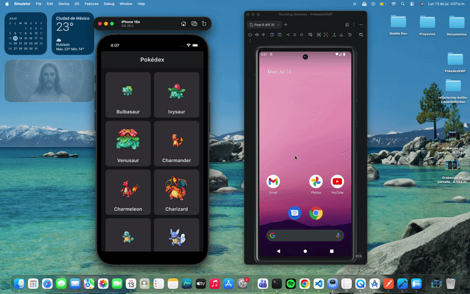
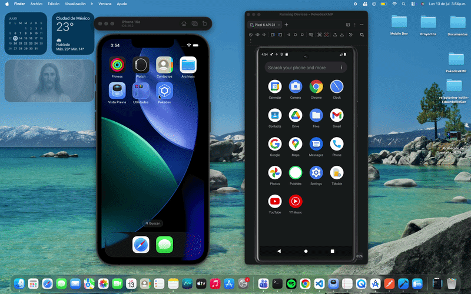
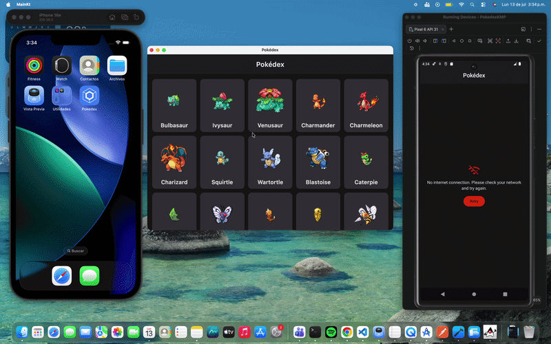

# Pokédex KMP

A multiplatform Pokédex (Android / iOS / Desktop) built with **Kotlin Multiplatform (KMP)** and **Compose Multiplatform (CMP)**, consuming the public [PokéAPI](https://pokeapi.co/). Built as a technical assessment to demonstrate Clean Architecture, MVVM, SOLID principles, and dependency injection in a real cross-platform codebase.

| Platform | Status | Demo |
|----------|:------:|:----:|
| Android | ✅ |  |
| iOS | ✅ |  |
| Desktop (JVM) | ✅ |  |

---

## Table of Contents

- [Getting Started](#getting-started)
- [Running Tests](#running-tests)
- [Architecture Overview](#architecture-overview)
- [Key Technical Decisions](#key-technical-decisions)
- [Tech Stack & Libraries](#tech-stack--libraries)
- [Screenshots / Demo](#screenshots--demo)
- [Known Limitations & Future Improvements](#known-limitations--future-improvements)

---

## Getting Started

### Prerequisites

| Tool | Version | Notes |
|---|---|---|
| JDK | 17+ | Required by AGP/Gradle |
| Android Studio | Koala (2024.1) or newer | With the **Kotlin Multiplatform** plugin installed |
| Xcode | 15+ | Only required to run the iOS target (macOS only) |
| Gradle | — | Bundled via the wrapper (`./gradlew`), no manual install needed |

No manual dependency installation is required — the project uses a Gradle version catalog (`gradle/libs.versions.toml`), so **Gradle sync will pull everything automatically**.

### 1. Clone & open

```bash
git clone <this-repo-url>
cd PokedexKMP
```

Open the root folder in **Android Studio** and let Gradle sync finish.

### 2. Run on Android

Select the `composeApp` run configuration with an Android device/emulator target, and click **Run** — or from the terminal:

```bash
./gradlew :composeApp:installDebug
```

### 3. Run on Desktop (JVM)

```bash
./gradlew :composeApp:run
```

### 4. Run on iOS

1. Build & embed the Kotlin framework once:
   ```bash
   ./gradlew :composeApp:embedAndSignAppleFrameworkForXcode
   ```
2. Open `iosApp/iosApp.xcodeproj` in Xcode.
3. Select a simulator and press **Run** (▶️). Xcode's build phase re-runs the Gradle task automatically on every build.

> If Xcode asks for signing, enable **Automatically manage signing** under the `iosApp` target's **Signing & Capabilities** tab (not required to run on a simulator).

---

## Running Tests

Unit tests cover the domain UseCases, the data mappers (critical for the image-resolution strategy, see below), and the presentation ViewModels — all using lightweight fakes, no mocking framework required.

```bash
# All modules, all targets
./gradlew allTests

# Or per module
./gradlew :domain:testDebugUnitTest
./gradlew :data:testDebugUnitTest
./gradlew :composeApp:testDebugUnitTest
```

| Module | What's covered |
|---|---|
| `domain` | `GetPokemonListUseCaseTest` — pagination params, success/error propagation, defaults |
| `data` | `PokemonMapperTest` — id extraction from URL, sprite URL construction, DTO→domain mapping |
| `composeApp` | `PokemonListViewModelTest` — Loading/Success/Empty/Error states, incremental pagination |

---

## Architecture Overview

The project follows **Clean Architecture** with a Gradle multi-module layout, each module owning a single responsibility and a strict, one-directional dependency rule:

```
composeApp  ──depends on──▶  domain  ◀──depends on──  data
composeApp  ──depends on──▶  designsystem
   data     ──depends on──▶  domain, core
   domain   ──depends on──▶  core
```

```
core/          Cross-cutting, framework-agnostic: AppError, DataResult (Either-like wrapper), DispatcherProvider.
domain/        Pure business layer: Pokemon/PokemonDetail models, PokemonRepository (port), UseCases.
               Zero dependency on Ktor, SQLDelight, or Compose.
data/          DTOs, Ktor RemoteDataSource, SQLDelight LocalDataSource, mappers, PokemonRepository implementation.
designsystem/  Theme, spacing/radius tokens, and reusable Compose components (Card, Skeleton, Chip, StatBar,
               Error/Empty states) — consumed only through UI primitives, never domain models.
composeApp/    Navigation, ViewModels (MVVM), Screens, Koin DI wiring, per-platform entry points.
```

`domain` never imports infrastructure (Ktor/SQLDelight/Compose) — it defines interfaces that `data` implements, satisfying the **Dependency Inversion Principle**. This is what makes the UseCases and ViewModels unit-testable with plain fakes, no framework or Android instrumentation needed.

### SOLID in practice

| Principle | Where it shows up |
|---|---|
| **S**ingle Responsibility | Each UseCase does exactly one thing; mappers only transform; the repository only orchestrates network vs. cache |
| **O**pen/Closed | Swapping the image source or adding a new data source doesn't require touching UseCases or ViewModels |
| **L**iskov Substitution | `PokemonRepository`, `PokemonRemoteDataSource`, `PokemonLocalDataSource` are all interchangeable — proven by the fakes used in tests |
| **I**nterface Segregation | Remote and local data sources are separate, focused interfaces instead of one bloated "data" contract |
| **D**ependency Inversion | `domain` defines the contract; `data` implements it; Koin wires the concrete implementation at runtime |

### MVVM + Sealed State

Every screen exposes a `sealed interface` UI state (`PokemonListUiState`, `PokemonDetailUiState`) through a `StateFlow`, consumed via `collectAsStateWithLifecycle()`. Because the state is sealed, the `when` block in Compose is exhaustive — the compiler forces every screen to explicitly handle `Loading`, `Success`, `Empty`, and `Error`.

---

## Key Technical Decisions

### 1. Resolving Pokémon images in the list endpoint

`GET /pokemon?limit=20&offset=0` does **not** return an image — only `name` and `url` (e.g. `.../pokemon/1/`).

| Option | Description | Decision |
|---|---|---|
| A. Fetch each of the 20 results' detail endpoint | N+1 extra requests per page | ❌ Rejected — slow, error-prone with partial failures, doesn't scale with pagination |
| **B. Derive the image from the `id` parsed out of `url`** | `raw.githubusercontent.com/PokeAPI/sprites/.../{id}.png` | ✅ **Chosen** |
| C. PokéAPI's beta GraphQL endpoint | Single query returns name + sprite | ❌ Rejected — still beta, would mix two networking paradigms in the same repository |

Extracting the `id` and building the sprite URL is a **pure, deterministic function** (`extractIdFromUrl`, `spriteUrl` in `data/mapper/PokemonMapper.kt`) — zero extra network calls, fully unit-tested (`PokemonMapperTest`). The **detail screen** uses the real image PokéAPI returns (`sprites.other.official-artwork`), falling back to the default sprite, and finally to the same derived URL as a last resort.

### 2. Persistence strategy

**SQLDelight** was chosen over key-value storage or flat files because:
- It's genuinely multiplatform (Android/iOS/Desktop) from a single SQL schema.
- The data is relational and queryable by id (paginated list + per-Pokémon detail), which fits tables better than a blob store.
- It generates compile-time-checked, typed APIs — no manual JSON parsing on disk.

**Consistency strategy (partial offline support):** *"network-first, cache as fallback."* `PokemonRepositoryImpl` always attempts a fresh network call first; if it fails (no connection, timeout, 5xx), it falls back to the last cached page/detail instead of surfacing an error. Only if the cache is also empty (e.g. first-ever launch with no connectivity) does the real `AppError` propagate to the UI. Every successful page and every visited detail is cached automatically.

### 3. Centralized error handling & mapping

A single mapping point — `data/mapper/ErrorMapper.kt` — translates Ktor/serialization/IO exceptions into a sealed `AppError` (`core/error/AppError.kt`). `AppError.toUserMessage()` centralizes the user-facing copy, so the list and detail screens never show raw exceptions or inconsistent messages.

### 4. Navigation

Only a primitive `pokemonId: Int` is passed between screens — never a fully-built `Pokemon` object — so the detail screen is self-contained and fetches its own data. This keeps it ready for a future deep link straight into a detail screen without depending on the list having been loaded first.

### 5. Dependency Injection with Koin

Modules are split by layer (`coreModule`, `domainModule`, `dataModule`, `appModule`) plus a `platformModule` per target (Android/iOS/Desktop) that resolves what varies by platform — e.g. `DatabaseDriverFactory` needs a `Context` on Android. ViewModels are resolved with `koinViewModel()`; the detail screen receives its `pokemonId` through Koin parameters (`parametersOf`).

---

## Tech Stack & Libraries

| Library | Purpose | Why it was chosen |
|---|---|---|
| **Kotlin Multiplatform** | Shared business logic & UI across Android/iOS/Desktop | Avoids duplicating domain/data/UI code per platform |
| **Compose Multiplatform** | Declarative UI | One UI codebase for all three targets; first-class Kotlin integration |
| **Ktor Client** | HTTP networking | Multiplatform-native (unlike Retrofit); pluggable engines per platform (OkHttp/Darwin) |
| **kotlinx.serialization** | JSON (de)serialization | Multiplatform, compile-time-checked, integrates directly with Ktor |
| **SQLDelight** | Local persistence | Multiplatform SQL with typed, compile-time-verified queries (see [persistence rationale](#2-persistence-strategy)) |
| **Koin** | Dependency Injection | Lightweight, multiplatform (no annotation processing/codegen needed like Hilt/Dagger, which are Android-only anyway) |
| **Navigation Compose (JetBrains fork)** | Screen navigation | Type-safe routes via `kotlinx.serialization`, multiplatform-ready |
| **Coil 3** | Async image loading & caching | Multiplatform successor to Coil 2; built-in memory/disk caching out of the box |
| **kotlinx.coroutines** | Async/concurrency | Standard for Kotlin async work; `DispatcherProvider` abstraction keeps it testable |
| **kotlin.test / kotlinx-coroutines-test** | Unit testing | Multiplatform test APIs, no need for JUnit4/Robolectric in shared modules |

---

## Screenshots / Demo

> _Add screenshots or a short screen recording here to show the list screen (with skeleton loading), the detail screen, and the error/empty states._

```
[ list screen ]      [ skeleton loading ]      [ detail screen ]      [ error state ]
```

---

## Known Limitations & Future Improvements

- [ ] **CI/CD**: no pipeline configured yet. Recommended next step: GitHub Actions running `./gradlew allTests` + `ktlint`/`detekt` on every PR.
- [ ] **Linting/formatting**: not enforced automatically yet (no `ktlint`/`detekt` wired into the build).
- [ ] **Accessibility**: basic support is in place (`contentDescription`, `semantics{}` on cards and stat bars), but full screen-reader pass (TalkBack/VoiceOver end-to-end) hasn't been done.
- [ ] **Search/filter**: the list currently only supports incremental pagination; filtering by type or name would be a natural next feature, likely as a new UseCase + a small state addition to `PokemonListUiState`.
- [ ] **Image sprite source resilience**: the list-image strategy depends on GitHub's raw sprite CDN staying available. If that ever becomes unreliable, the fallback would be to switch to fetching `sprites.front_default` from the detail endpoint for visible items only (windowed, not N+1 for the whole page).
- [ ] **UI tests**: current test coverage is UseCases, mappers, and ViewModels; no Compose UI/instrumentation tests yet — reasonable ROI trade-off for the scope of this assessment, but would be a next step for a production app.
- [ ] **Dark mode polish**: `PokedexTheme` supports light/dark via `isSystemInDarkTheme()`, but hasn't been visually QA'd in dark mode.
